# How to use Station Software

In this document, we will introduce how to use Station Software to run the Train of CORD workshop task C

## Login

In the welcome page of Station Software, you could sign up an account.

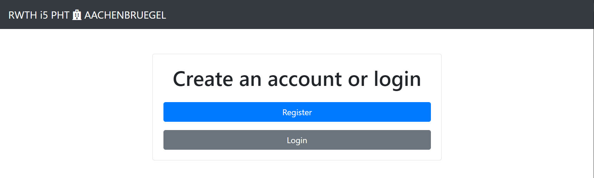

In order to use Station Software, you will have to sign in with your account.

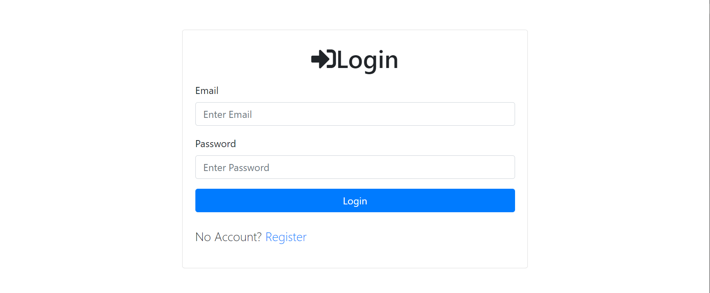

## Dashboard

Once the job is created in the Central Service, you will find a Train request in Dashboard page.

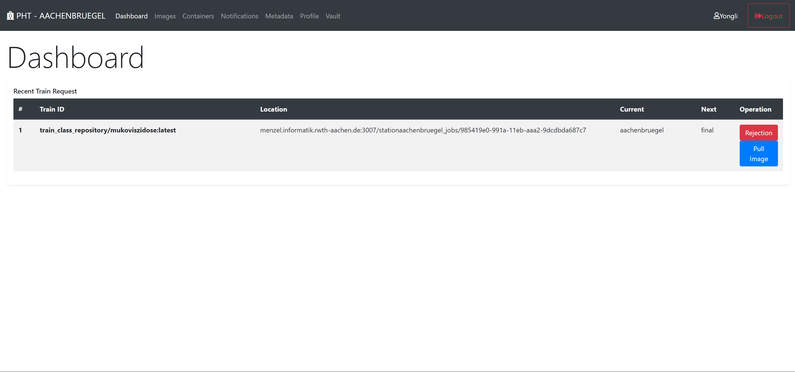

If the Train violates any privacy regulation, you could reject the Train by clicking "Rejection", otherwise you could download the Train by clicking "Pull Image".

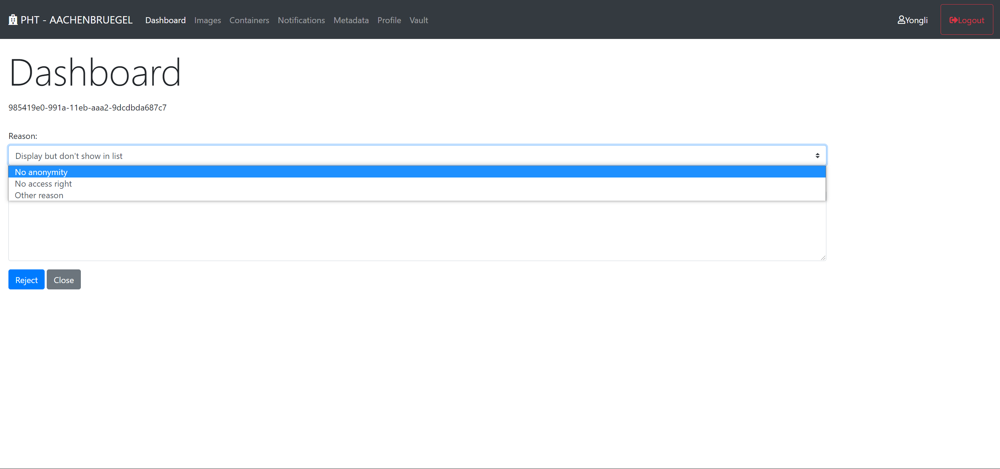

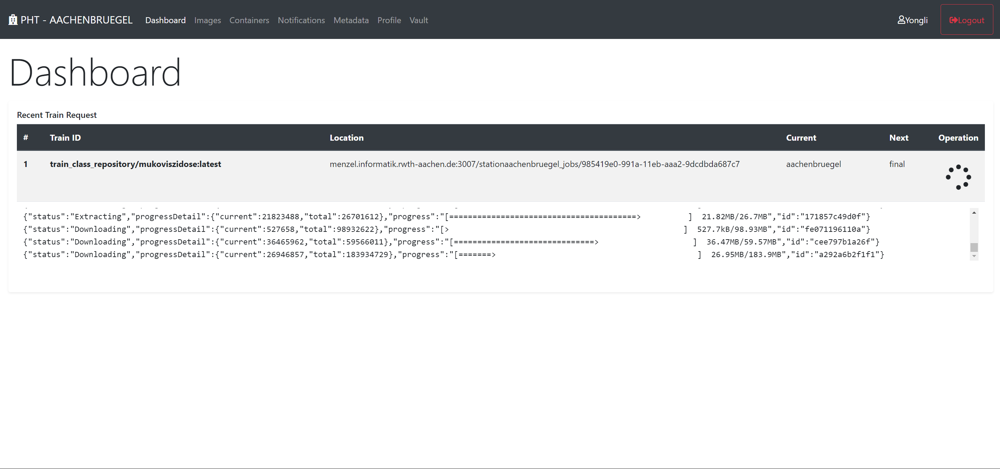

## Train Execution

Once the Train is downloaded, you could execute the Train by creating a Container.

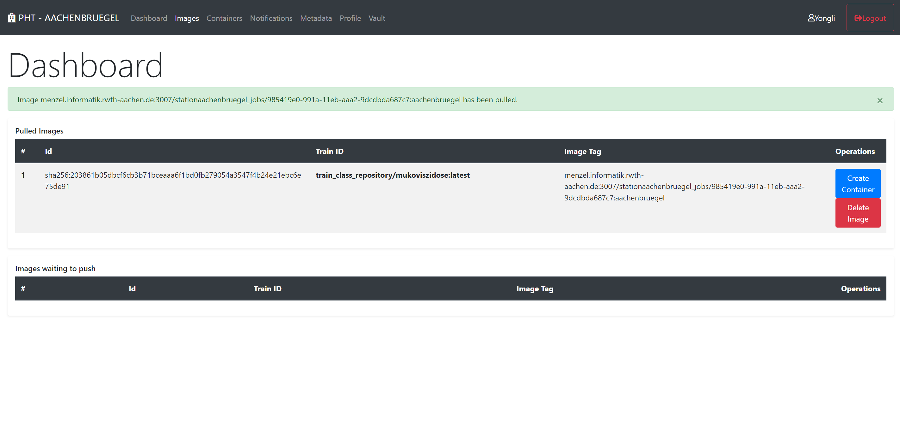

In CORD Workshop task C use case, you have to pass the API url as environment variable to the container in the format of "http://HAPI_IP:HAPI_PORT/fhir/"

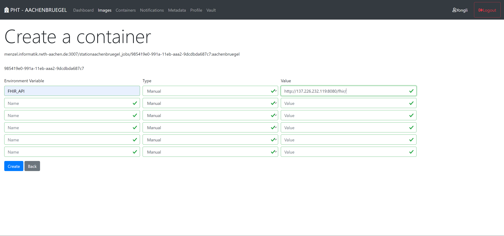

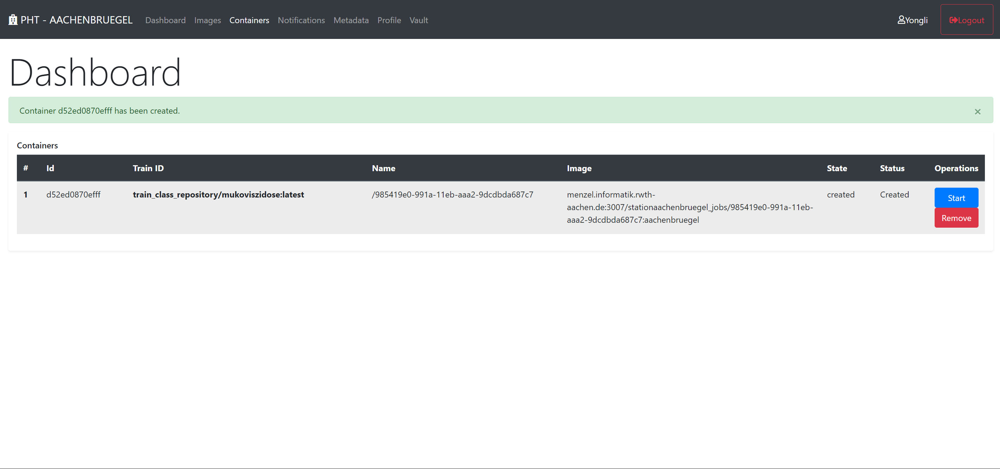

Now you could execute the Train by click "start" button and wait until the Train is finished.

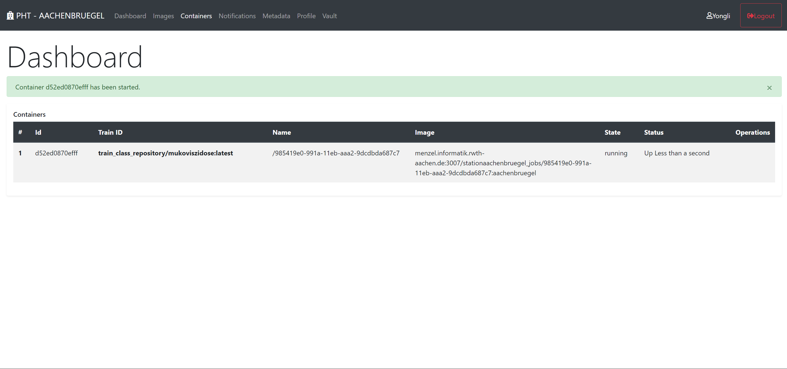

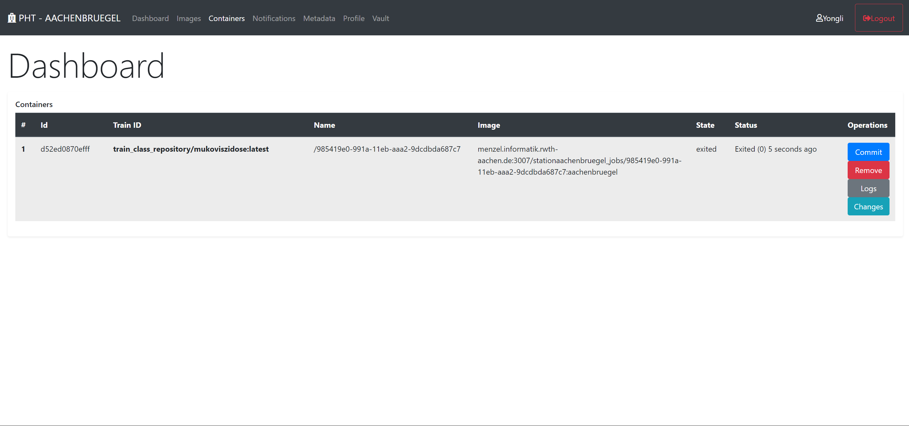

After the Train is finished, you could check the log information by clicking "Logs" and inspect the changes and results by clicking "Changes".

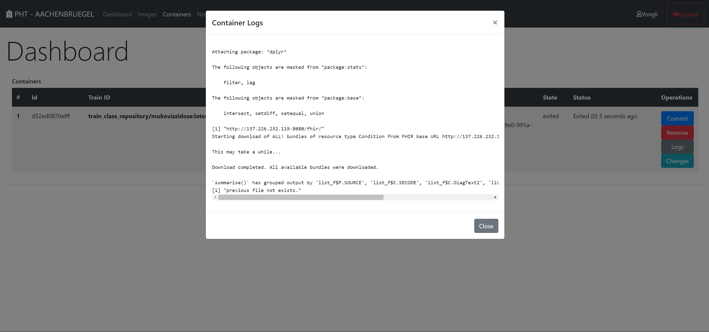

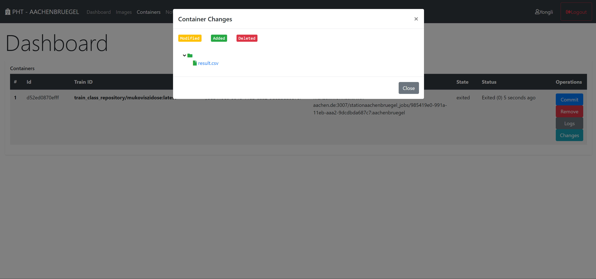

## Push back the Train

You could click "Commit" to aggregate the results to the Train.

Clicking "Push Image", the Train will be sent back to Central Service. The Train execution on a Station is then finished.

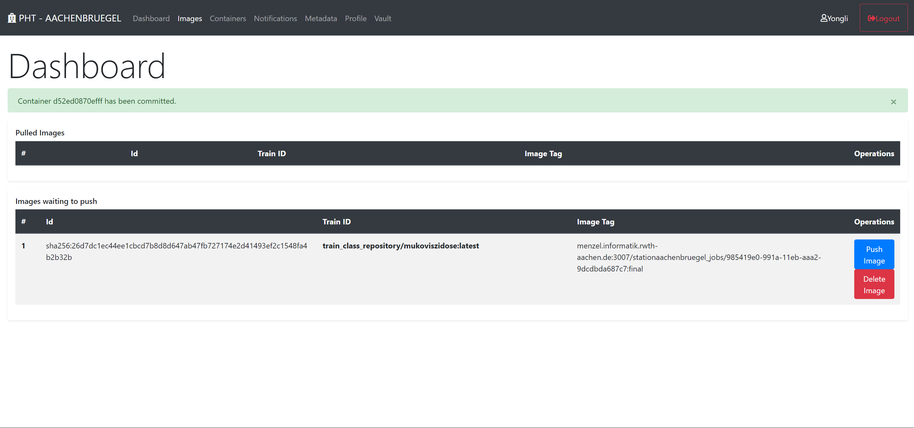

