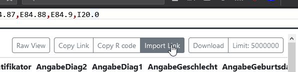

# Table of Contents 
Im Projectathon 4, der Ablage Untergliederung Von Aufgabenblock A werden

## Aufgabenblock A: Alterspyramiden für ausgewählte Diagnosen
--- 

### A.0.            [Aufgabenstellung & Daten](../Aufgabenblock_A/a_0_aufgabenstellung_und_daten/) 
---

#### A.0.1           [Aufgabenstellung](../Aufgabenblock_A/a_0_aufgabenstellung_und_daten/)

#### A.0.2           [Daten](../Aufgabenblock_A/a_0_aufgabenstellung_und_daten/)

### A.1.            [Ablage FHIRExtinguisher](../Aufgabenblock_A/a_1_ablage_fhirextinguisher/)
 
--- 
#### A.1.1.          [Tool Download-Bereich FHIR-Extinguisher](https://imigitlab.uni-muenster.de/published/fhirextinguisher/-/releases)

#### A.1.2.          [Projektbereich FHIR-Extinguisher (z.B. für Fehlermeldungen, Präsentationen, …)](../Aufgabenblock_A/a_1_ablage_fhirextinguisher/a_1_2_projektbereich/)

#### A.1.3.          Anleitung/Musterlösung FHIRExtinguisher
1. Starten Sie den FhirExtinguisher. Öffnen Sie dazu ein Terminal in den Ordner, in den Sie die .jar-Datei heruntergeladen haben,
   und führen den folgenden Befehl aus: `java -jar FhirExtinguisher-1.6.1-all.jar -f https://mii-agiop-cord.life.uni-leipzig.de/fhir/ -p 8080`
2. Öffnen Sie die Oberfläche in ihrem Browser (`http://localhost:8080/`)   
2. Klicken Sie auf "Import Link":
   
3. Fügen Sie den folgenden Link ein: `Condition?code=E70.0,E84.0,E84.1,E84.80,E84.87,E84.88,E84.9,I20.0&_count=1000&__limit=5000000&__columns=PatientIdentifikator%3AgetIdPart(subject)%40join(%22%2C%20%22)%2CEinrichtungsidentifikator%3Asubject.resolve().meta.source.substring(0%5C%2C%20indexOf(%22%23%22))%40join(%22%2C%20%22)%2CAngabeDiag2%3A%22-%22%40join(%22%2C%20%22)%2CAngabeDiag1%3Acode.coding.where(system%3D'http%3A%2F%2Ffhir.de%2FCodeSystem%2Fdimdi%2Ficd-10-gm').code%40join(%22%2C%20%22)%2CAngabeGeschlecht%3Asubject.resolve().gender.substring(0%5C%2C1)%40join(%22%2C%20%22)%2CAngabeGeburtsdatum%3Asubject.resolve().birthDate%40join(%22%2C%20%22)%2CTextDiagnose1%3Acode.coding.where(system%3D'http%3A%2F%2Ffhir.de%2FCodeSystem%2Fdimdi%2Ficd-10-gm').display%40join(%22%2C%20%22)%2CTextDiagnose2%3A%22-%22%40join(%22%2C%20%22)`
4. Sie sollten jetzt das Ergebnis der Query mit den entsprechenden Spalten in der Vorschau sehen.
5. Fügen Sie `&encounter.service-provider=260123451-Airolo`, an die FHIR Search-Query an, um die Suche die Patienten einer 
   Einrichtung zu beschränkenund klicken Sie auf `GET`.
6. Klicken Sie auf "Download", um eine CSV-Datei herunterzuladen, oder klicken Sie auf "Copy Link" um einen Link zu kopieren.
7. Lesen Sie die CSV-Datei/den Link mittels des R-Befehls `read.csv("<filename or link>")` ein.
8. Beenden Sie den FhirExtinguisher, in dem Sie in dem Terminal mit <kbd>Strg</kbd>+<kbd>C</kbd> den FhirExtinguisher beenden.

### A.2.            [Ablage R-Auswertungen Alterspyramiden](../Aufgabenblock_A/a_2_ablage_zur_alterspyramiden/) 
--- 

#### A.2.1.          [Projektbereich R-Auswertungen](../Aufgabenblock_A/a_2_ablage_zur_alterspyramiden/a_2_1_projektbereich/)

#### A.2.2.          [Anleitung/Musterlösung R-Auswertung Alterspyramiden](../Aufgabenblock_A/a_2_ablage_zur_alterspyramiden/a_2_2_musterlösung_r_auswertung/)

#### Im A.2 Readme Verweis auf R-Archiv fhircrackr (CRAN)
Cran: <https://CRAN.R-project.org/package=fhircrackr>

Quellcode: <https://github.com/POLAR-fhiR/fhircrackr>
### A.3.             Ablage Ergebniszusammenführung mit EasySMPC 
--- 
#### A.3.1.          Tool EasySMPC 

<https://github.com/prasser/easy-smpc/releases/tag/v1.0.0-alpha>

#### A.3.2.          Projektbereich EasySMPC

<https://github.com/prasser/easy-smpc> 

#### A.3.3.          [Anleitung /Musterlösung EasySMPC Zusammenführung Alterspyramiden](../Aufgabenblock_A/a_3_ablage_zur_ergebniszusammenfuehrung_mit_easysmpc/a_3_3_musterloesung_easysmpc/)

